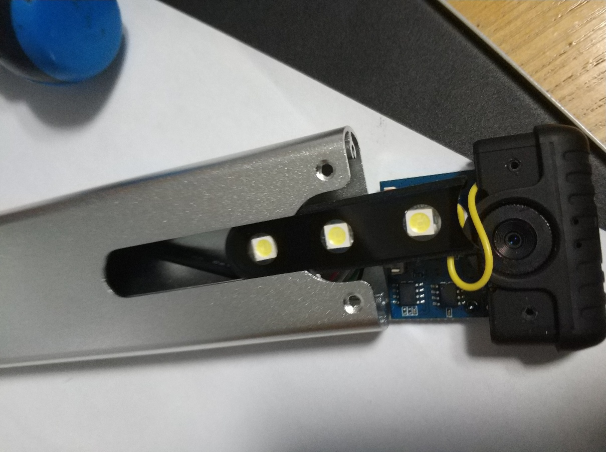
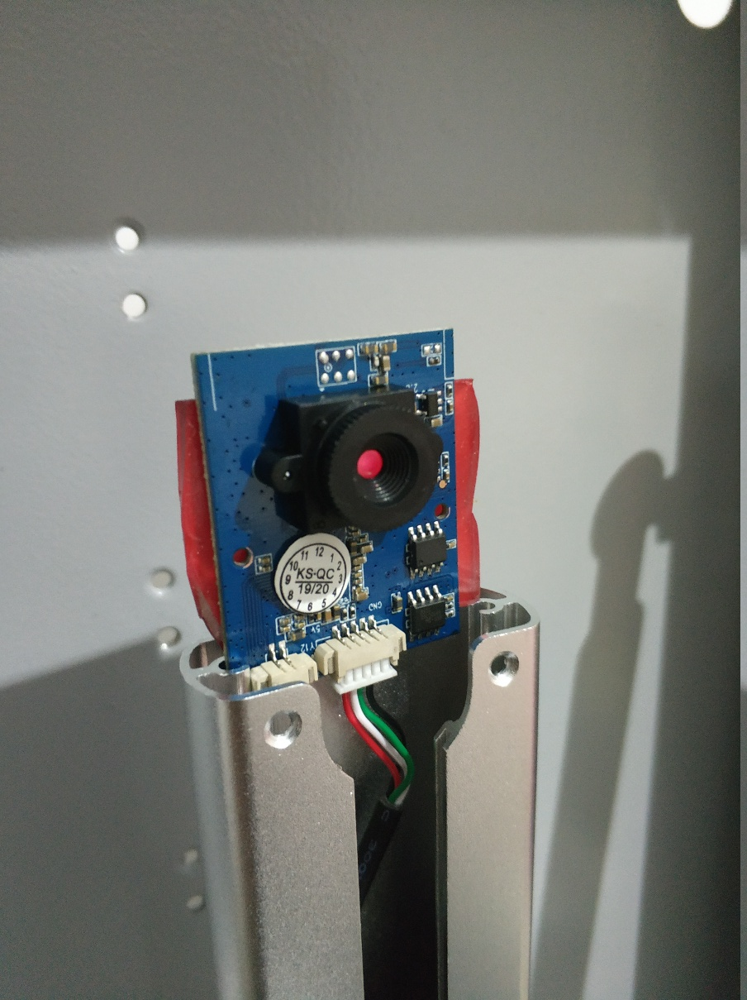
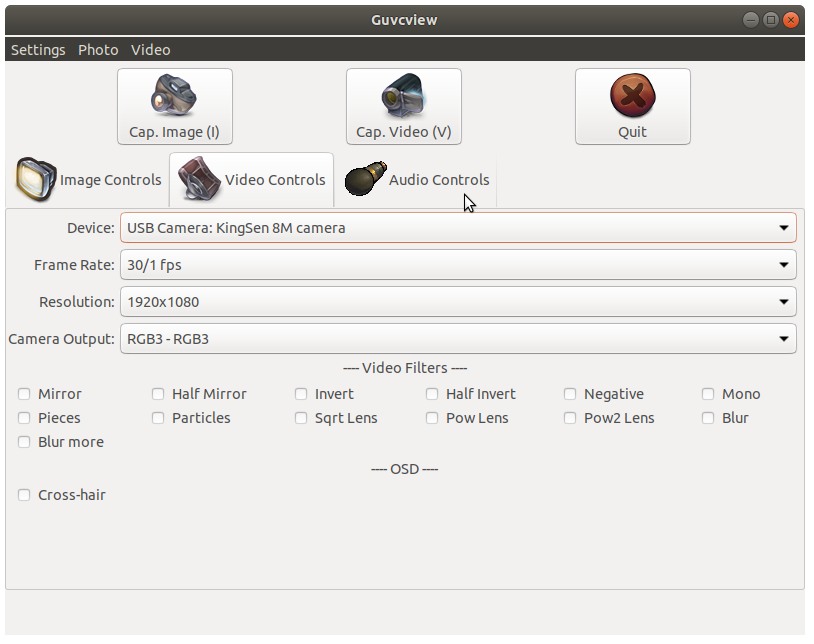
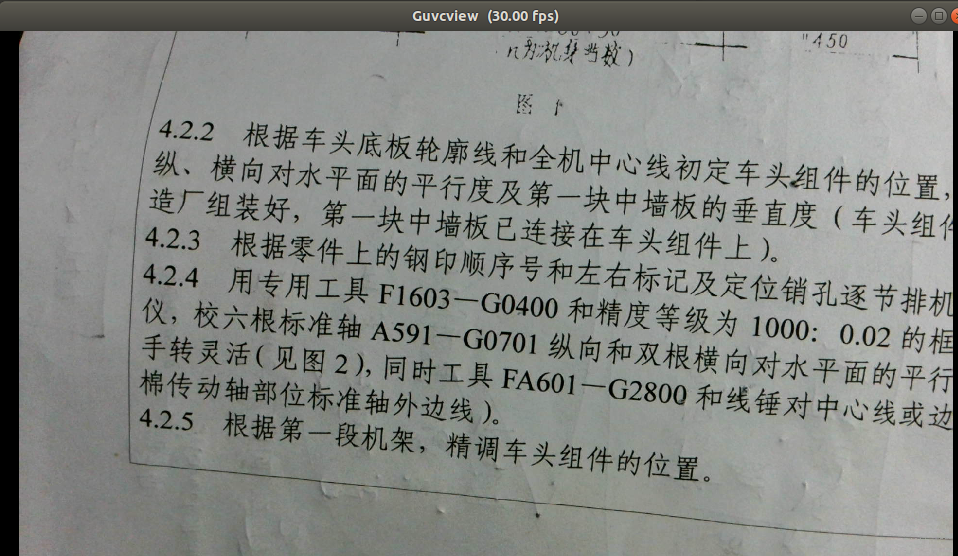
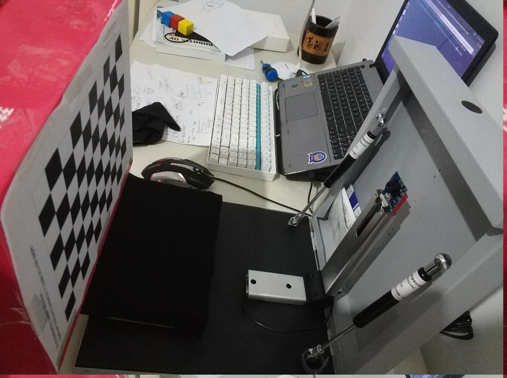
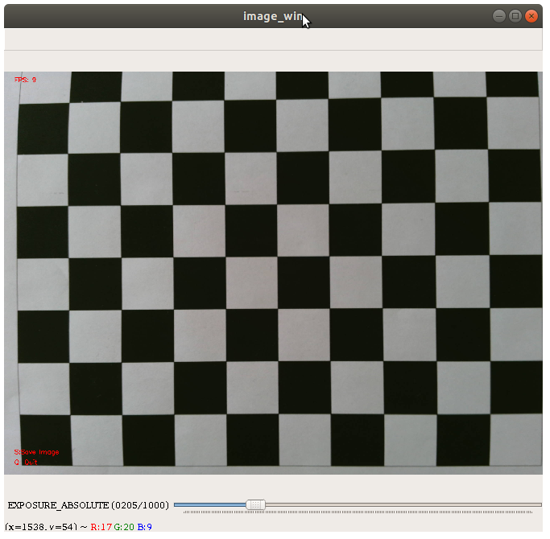
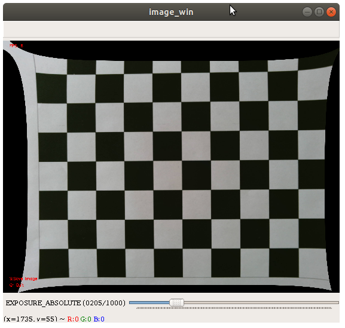
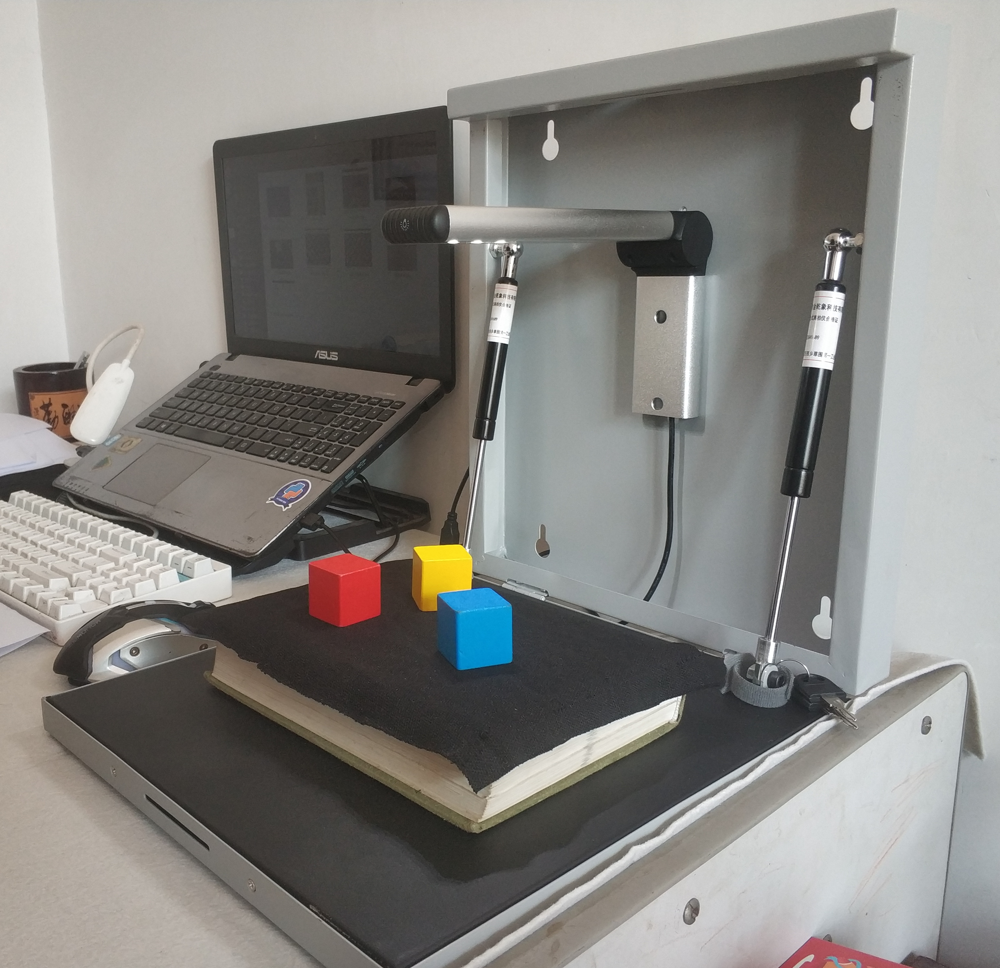
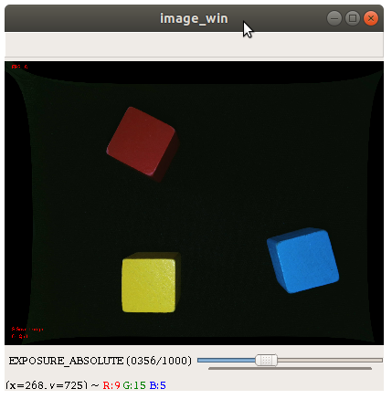
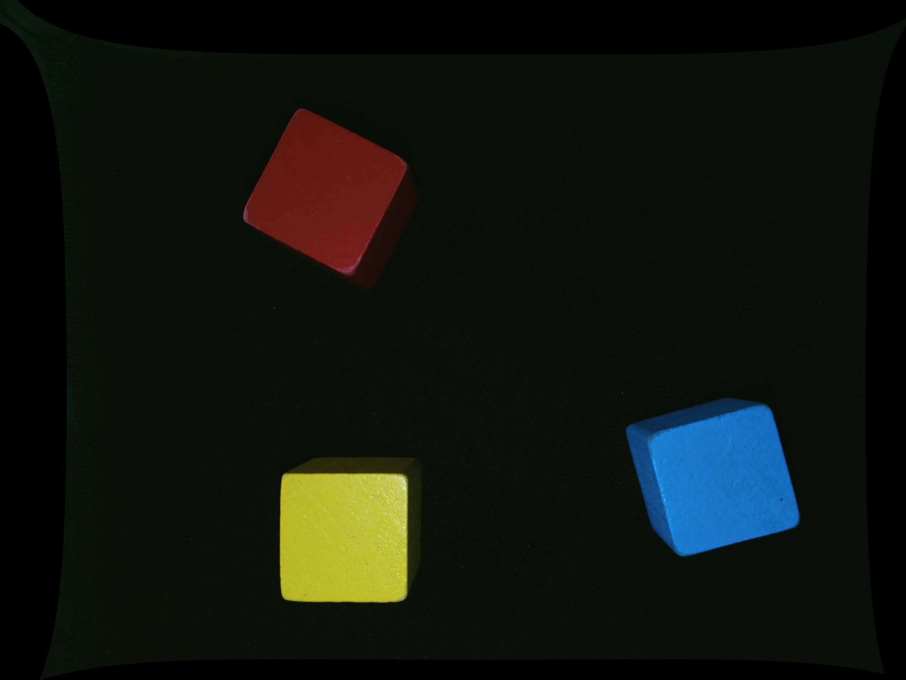

# 摄像头调试流程


## 修改设备号

修改配置文件`config.py`里面摄像头的设备号

```python
# 摄像头的设备号
# 默认为 /dev/video0
CAM_PORT_NAME = '/dev/video0'
```


## 摄像头拆卸

原厂的摄像头模组被封闭在一个外壳里面, 没办法直接调焦, 所以需要将外壳拆掉．



在摄像头调试的过程中, 只需保留usb线与摄像头模块之间的连接, 其他模块组件拆下来放在一边.




## 摄像头对焦

> TODO 安装摄像头调试软件.

运行uvc摄像头调试软件:

```
guvcviewer
```

> 注: 任意一款摄像头调试软件都是可以哒．

选择设备`KingSen 8M camera`

分辨率选择`1920x1080`

> 摄像头的最高分辨率为2595 x 1944, 分辨率越高对对焦就越方便.



让摄像头镜头处距离纸面(纸上最好有密密麻麻的字) 17cm, 然后旋转镜头, 对镜头进行微调, 摄像头对焦

> 注: 17cm是指的当物块放在工作台上, 物块的上表面与镜头之间的垂直距离.
>
> 17cm并不是定值, 可以根据自己的需要调整.




## 摄像头标定数据采集

设置`config.py里面的自动曝光为True`

```python
# 自动曝光
# 采集标定图片的时候/ArucoTag识别，　设置自动曝光为True
# 色块识别的时候，　设置自动曝光为False
CAM_EXPOSURE_AUTO = True
```

运行图像采集的脚本, 设定标定图像采集位置为`data/caliborad`

```bash
python3 cv_camera.py --img_path data/caliboard
```


标定板打印出来, 摆放不同的姿态, 采集图像.



> TODO 补充


## 摄像头标定

打印标定板, 并测量格子的实际尺寸, 单位为cｍ, 将尺寸更新到配置文件`config.py`.

```python
#############################
## 相机标定
## 
#############################
CALI_BOARD_GRID_SIZE = 2.05 # 单位cm
```


执行相机标定程序

```bash
 python3 cv_camera_calibration.py 
```

获取相机标定参数

*输出日志*

```
python3 cv_camera_calibration.py 
['data/caliboard/3.png', 'data/caliboard/2.png', 'data/caliboard/17.png', 'data/caliboard/9.png', 'data/caliboard/6.png', 'data/caliboard/11.png', 'data/caliboard/5.png', 'data/caliboard/1.png', 'data/caliboard/16.png', 'data/caliboard/14.png', 'data/caliboard/8.png', 'data/caliboard/15.png', 'data/caliboard/7.png', 'data/caliboard/4.png', 'data/caliboard/13.png', 'data/caliboard/10.png', 'data/caliboard/0.png', 'data/caliboard/12.png']
图片缺失完整角点 : data/caliboard/5.png
图片缺失完整角点 : data/caliboard/14.png
图片缺失完整角点 : data/caliboard/15.png
相机内参 intrinsic
[[2.48941522e+03 0.00000000e+00 1.31588004e+03]
 [0.00000000e+00 2.50734651e+03 1.01192616e+03]
 [0.00000000e+00 0.00000000e+00 1.00000000e+00]]
畸变参数 distortion
[[ 1.33379091e-01 -9.95048879e-02  3.16621886e-03  3.63615914e-05
  -9.69321905e-01]]

```


畸变去除之前




畸变去除之后




## 调整摄像头曝光度


修改`config.py` , 设置自动曝光为`False`

```python
CAM_EXPOSURE_AUTO = False
```


打开摄像头补光灯的开关, 调到最大档位.


将物块摆放在工作台上.




运行摄像头脚本, 打开去除畸变模式

```
python3 cv_camera.py --rm_distortion 1
```

拖动滑动条，手动调整摄像头的曝光值.





调整的目的是, 尽可能增大立方体上表面与四周表面的亮度上的差别.




将调节的曝光值, 同步到`config.py`配置文件里．

```python
# 相机曝光
CAM_EXPOSURE_ABSOLUTE = 296 # 白天 
# CAM_EXPOSURE_ABSOLUTE = 687 # 晚上
```

补光灯的功率有限, 房间内的光照强度会对图像采集产生影响, 建议在白天和晚上设置不同的曝光值.

## 图像样本采集

按`S`键, 可以采集多个样本图像, 图像会默认保存在`src/data/image_raw`路径下

**样本采集建议**

1. 因为色块表面是油漆材质, 会反光. 为了获取比较好的效果, 你需要将同一个颜色的色块摆放在工作区域中不同的位置, 采集多组样本图像. 
2. 采集的过程中, 最好是画面中同时具有这三个颜色的色块, 为后续的可视化阈值调参提供参考.