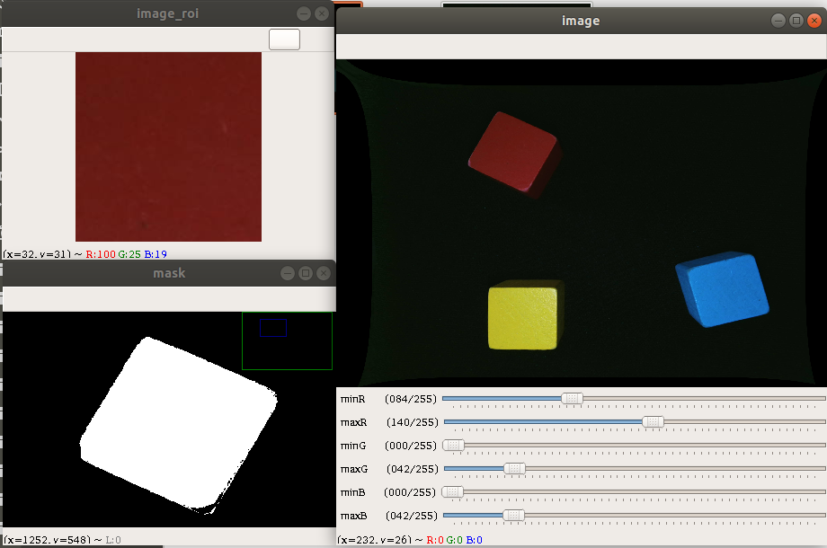

# 机械臂色块抓取

[toc]


## 预备工作

1. 将摄像头的USB线接到树莓派4的USB口

2. 触摸三次补光灯的开关, 将补光开到最大.

   

## 运行颜色阈值可视化调参工具

色块颜色阈值调节在BGR颜色空间下进行．

运行颜色阈值调节工具

```
python3 cv_threshold_util.py data/image_raw/0.png 
```

注: `data/image_raw/0.png `是样本图片的相对路径, 是之前我们运行`cv_camera.py` 脚本采集的样本图片





操作流程演示 :　[颜色阈值调节工具-视频.mkv](颜色阈值调节工具-视频.mkv)

1. 使用鼠标选中物块上表面的ROI区域, 回车确定勾选.

   
   
2. 然后你会获得这个ROI区域的RGB三个通道的统计图

   

3. 依据统计图, 拖动滑动条, 对BGR颜色空间的阈值进行可视化调参(如视频所示).

   每次修改阈值, 在终端都会打印出来阈值上界与下界, 如下所示:

   ```
   更新阈值 颜色空间BGR (B蓝, G绿, R红)
   阈值下界: (0, 0, 84)
   阈值上界: (42, 42, 140)
   ```

4. 保存颜色阈值到配置文件`config.py`

   直接追加到对应的列表里面, 你也可以将原来的删掉.

   ```python
   # 红色色块的颜色阈值(BGR)
   RED_BLOCK_LOWERB = [(0, 0, 120), (90, 60, 150), (0, 0, 150), (0, 0, 50),(0, 0, 90)]
   RED_BLOCK_UPPERB = [(90, 90, 180),(255, 255, 255), (120, 120, 255), (40, 40, 100), (70, 70, 156)] 
   
   # 黄色色块的颜色阈值(BGR)
   YELLOW_BLOCK_LOWERB = [(23, 150, 150), (0, 90, 90)]
   YELLOW_BLOCK_UPPERB = [(109, 210, 210), (125, 255, 255)]
   
   # 蓝色色块的颜色阈值(BGR)
   BLUE_BLOCK_LOWERB = [(152, 95, 0), (180, 140, 0), (180, 180, 55), (125, 75, 0)]
   BLUE_BLOCK_UPPERB = [(238, 164, 44), (255, 255, 60), (255, 255, 200), (190, 150, 72)]
   
   ```

## 查看色块检测与位姿估计的效果

运行脚本, 查看色块检测的效果

```bash
python3 test_cv_color_cubic.py
```


色块上面会有一个罩层, 罩层是通过颜色阈值得到的二值化图像，依据罩层就可以看到二值化图像的质量。

如果效果比较差, 则需要继续采集新的样本图像, 并进行阈值调参。

左上角展示的是每个颜色的色块在工作台坐标系下的坐标(2D)。


## 修改工作台的偏移量

将红色物块放在工作台的中心位置, 令红色色块在工作台上的坐标尽可能接近`RED (0, 0)`

调整机械臂末端的坐标,  让气泵的末端刚好落在物块上表面的中心位置.

```python
from fs_arm_4dof import Arm4DoF
from config import *
arm = Arm4DoF()
# 调整下面的这个坐标
arm.move([13, -0.5, -2])
```


同步修改`config.py`里面的`WORKSPACE_ORIGIN_POSI`

```python
#############################
## 工作台配置
##
#############################
# 工作台原点坐标在机械臂基坐标系下的位置
WORKSPACE_ORIGIN_POSI = (13, -0.5, -2)
```

> 注: 因为摄像头的镜头与感光芯片之间的装配误差可能摄像头视觉中心不一定落在工作台的中心, 会存在一定的偏移量,每个摄像头的参数都不太一样。


## 设置色块目标位置

修改配置文件`config.py`里面的`COLOR_CUBIC_TARGET_POSI`参数, 根据盒子/笔筒所在的位置，填写不同颜色的物块的目标位置(释放点在机械臂基坐标系下的坐标).

```python
# 色块抓取存放位置(在机械臂基坐标系下)
COLOR_CUBIC_TARGET_POSI = {
    'RED': (1, 15, 0), # 红色色块
    'YELLOW': (1, -15, 0), # 黄色色块
    'BLUE': (12, 14, 0)} # 蓝色色块
```


## 机械臂色块抓取

执行机械臂色块抓取的脚本

```bash
python3 arm_color_cubic_grasp.py
```


> TODO, 视频文件过大, 待效果视频发布, 添加效果视频链接