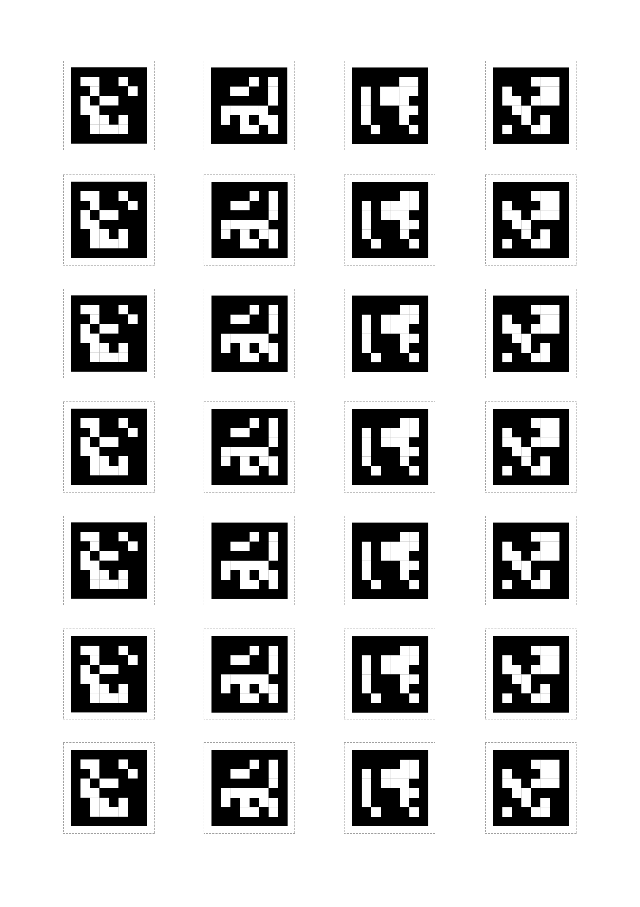
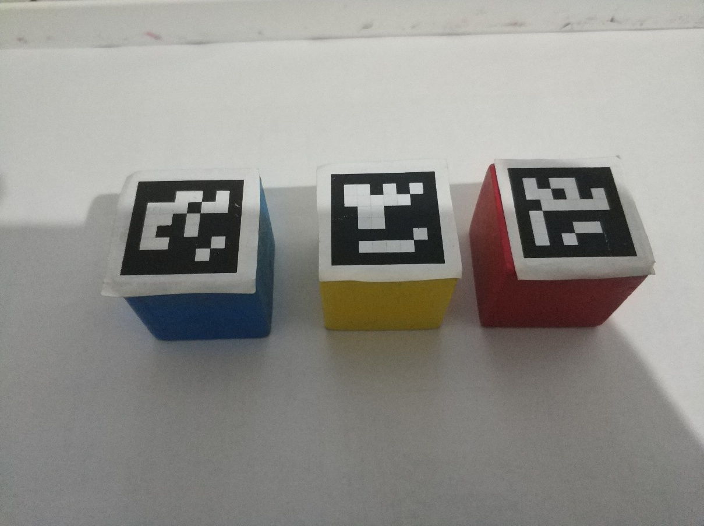

# 机械臂ArucoTag物块抓取


[toc]

## 制作ArucoTag物块

将`appendix/ArucoTag/ArucoTag_25_30mm.png` 文件打印在A4纸上, 打印的时候注意要以*实际尺寸*打印, 不要自适应边框.

从左到右, ArucoTag的ID号, 分别为1, 2, 3, 4.



沿着**虚线**裁剪下来然后张贴到木块上, 一定要保留一部分的白色边框,  这样图像处理才会稳定.





量一下黑色边框的尺寸, 然后同步修改`config.py`

```python
#############################
## ArucoTag的配置参数
##
#############################
ARUCO_SIZE = 2.5 # ArucoTag的尺寸 单位cm, 打印在A4纸上面
```

> 注: 因为打印机也有打印误差, 所以不一定是2.5, 存在一定的误差, 使用游标卡尺进行测量。


## 修改工作台的偏移量

> 略, 参考机械臂色块抓取.md


## 查看ArucoTag检测与位姿估计的效果

```bash
python3 test_cv_aruco.py
```


[效果视频-.ArucoTag检测与测量效果](./video/6.ArucoTag检测与测量效果.mkv)


##　设置ArucoTag的目标存放位置


修改`config.py` 文件

```python
# ArucoTag物块抓取存放位置(在机械臂基坐标系下)
ARUCO_CUBIC_TARGET_POSI = {
    1: (1, -15, 0),
    2: (1, 15, 0),
    3: (12, 14, 0)}
```


## 机械臂ArucoTag物块抓取

```bash
python3 arm_aruco_cubic_grasp.py
```

> TODO, 视频文件过大, 待效果视频发布, 添加效果视频链接